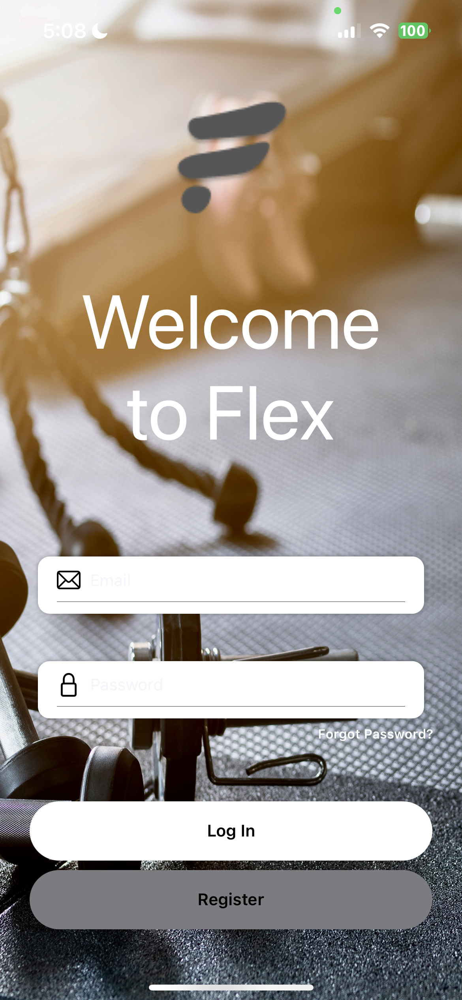
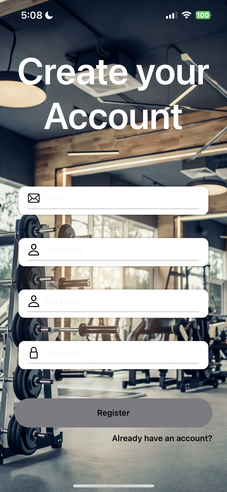
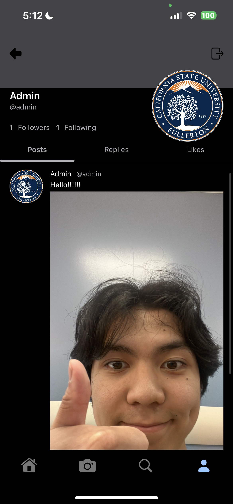

# Flex
This project is an IOS Application made using SwiftUI, KingFisher, and Firebase.

This was made for our 362 Software Engineering Class by: Derek Le, Aban Domingo, David Vu, and Valeria Sanchez.

We create this app with the fitness lifestyle in mind. We would like users to post their fitness progress and share it with the community.

As this app is just a devleopment project, we have chosen not to host it online.
This app requires XCode to run and download and must have a GoogleInfo.plist created from Firebase in order to interact with Firebase.

Follow the steps here to create a GoogleInfo.plist: https://firebase.google.com/docs/build

Make sure to include the Firebase SDK in your Xcode Packages. https://github.com/firebase/firebase-ios-sdk.git

These tutorials really helped us to get started:
https://www.youtube.com/watch?v=3pIXMwvJLZs&ab_channel=AppStuff
https://www.youtube.com/watch?v=5gIuYHn9nOc

# Demo Examples

# Login

# Register

# Forgot

# Feed

